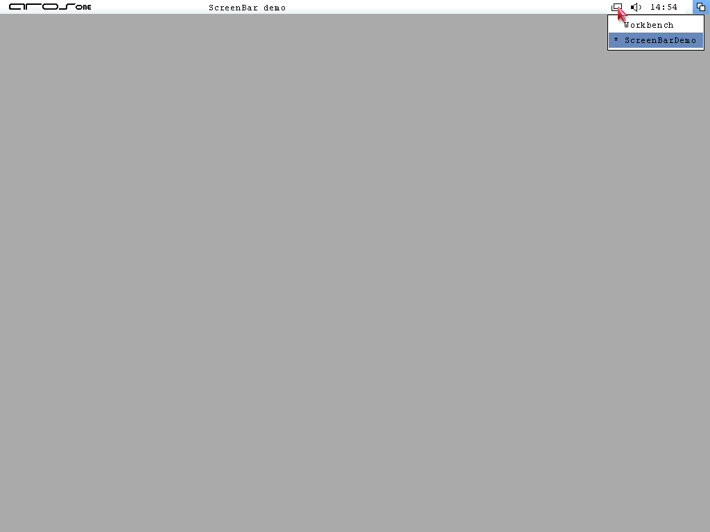

# AROS ScreenBar

An experimental native AROS screen-bar companion with a clock, an audio-settings
shortcut and direct public-screen selection. The standalone version places a
small borderless overlay beside the existing screen-depth gadget.



Screen chooser on the optional demonstration screen.

## Features

- Live `HH:MM` clock using the screen font and colors.
- Speaker icon opens `SYS:Prefs/AHI`.
- Frameless screen chooser with highlighted selection and current-screen marker.
- Mouse selection, Up/Down, Return or keypad Enter, and Escape.
- Keyboard scrolling when the list exceeds the available height.
- Optional second public screen for trying screen switching.

```sh
ScreenBar --demo
```

Click the screen button again, press Escape in the chooser, or move focus away to
close it. Escape while the bar is focused, or Ctrl-C in its launching Shell, exits
ScreenBar. `--seconds N` limits a run; `--log PATH` records events.

## Status

Experimental iteration 2, verified on x86_64 AROS ABIv11. Mainline ABI v1 has not
been verified. Only Workbench and the optional demo receive a bar; other public
screens can be selected. Unregistered private application screens are excluded. Registered screens that
become temporarily private may appear but cannot be selected.

The speaker is an AHI preferences shortcut, not a global volume control. No
autostart is installed. Outside clicks dismiss the chooser on focus loss and
also reach the underlying window. Overlay clicks can change focus; this is not
a system-integrated menu or a complete desktop service.

- [Build and tests](docs/development.md)
- [Architecture and limitations](docs/architecture.md)
